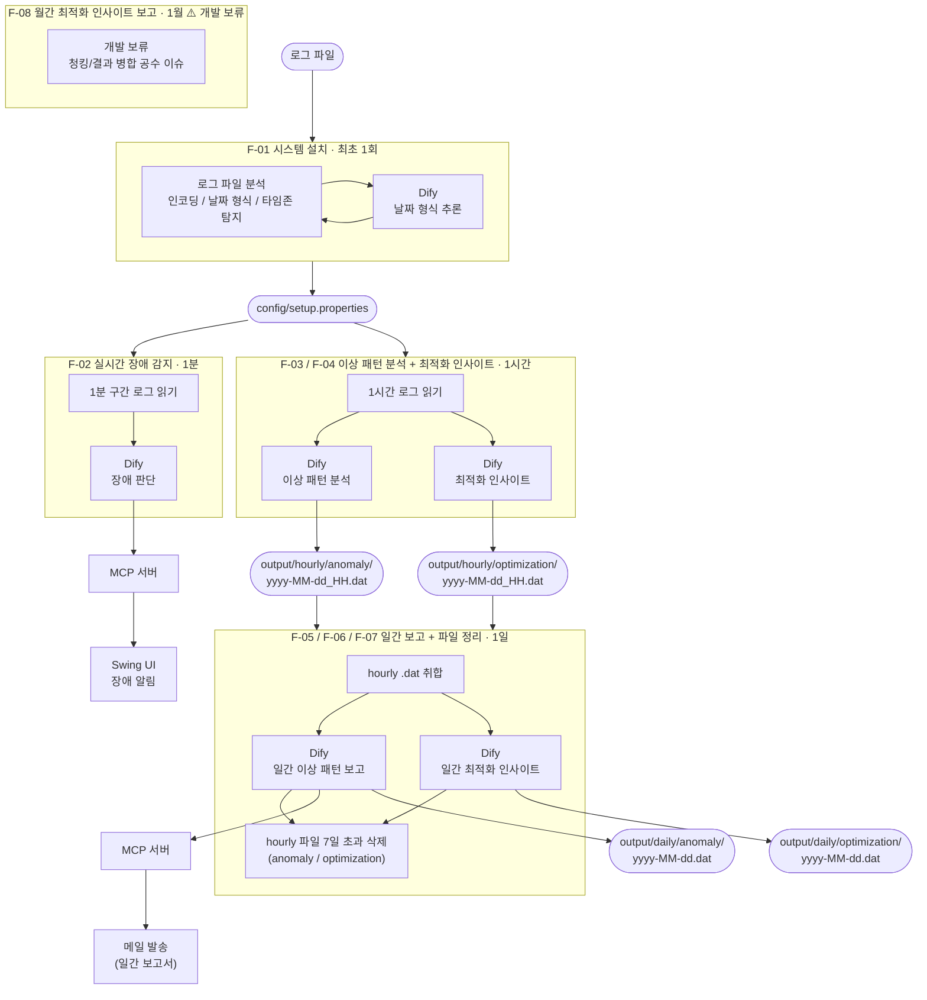

# 시스템 흐름도

> 배치 간 데이터 흐름과 구축 서버 ↔ Dify ↔ MCP 통신 흐름을 나타낸다.

<!-- 시각화 방법
  1. GitHub / GitLab : 파일을 웹에서 열면 자동으로 렌더링됨
  2. VS Code : "Markdown Preview Mermaid Support" 익스텐션 설치 후 미리보기(Cmd+Shift+V)
  3. 온라인 : https://mermaid.live 접속 → 아래 코드블록 내용 붙여넣기
  4. 보고서용 이미지 : mermaid.live 우측 상단 Export → PNG / SVG 다운로드
-->

---

## 변경 이력

| 버전 | 날짜 | 내용 | 작성자 |
|------|------|------|--------|
| v1.0 | 2026-06-23 | 초안 완성 | |
